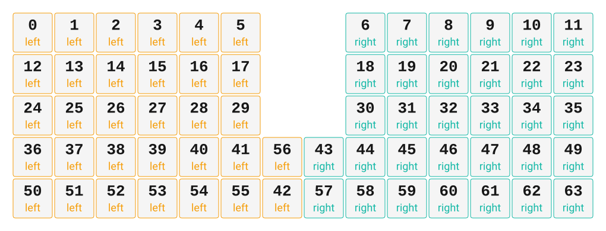

# ZMK Configuration for Stainless

*Generated by Shield Wizard for ZMK*



Download compiled firmware from the Actions tab. <https://zmk.dev/docs/user-setup#installing-the-firmware>

Edit your keymap <https://zmk.dev/docs/keymaps>.
User keymap is located at [`config/stainless.keymap`](config/stainless.keymap).

-----

<details>
<summary>
Shield Wizard Debug Information
</summary>

In case of broken configuration, here is the Shield Wizard internal data used to generate this configuration:

Commit: 5840d41ac0915092c8fe45da617ffb4bb91e1b97

```json
{"name":"Stainless","shield":"stainless","dongle":true,"modules":[],"layout":[{"id":"01KMGSH76DYWGCNS4K65QQXWT6","part":0,"row":0,"col":0,"w":1,"h":1,"x":0,"y":0,"r":0,"rx":0,"ry":0},{"id":"01KMGSH76D9GBHBMN1JYV45QWA","part":0,"row":0,"col":1,"w":1,"h":1,"x":1,"y":0,"r":0,"rx":0,"ry":0},{"id":"01KMGSH76DCS6Q0YDD9BESFA2M","part":0,"row":0,"col":2,"w":1,"h":1,"x":2,"y":0,"r":0,"rx":0,"ry":0},{"id":"01KMGSH76D3AA417WTTNMR03QA","part":0,"row":0,"col":3,"w":1,"h":1,"x":3,"y":0,"r":0,"rx":0,"ry":0},{"id":"01KMGSH76D79P1GFYFAJHFET0B","part":0,"row":0,"col":4,"w":1,"h":1,"x":4,"y":0,"r":0,"rx":0,"ry":0},{"id":"01KMGSH76DMZ42QHAHFMABZA6R","part":0,"row":0,"col":5,"w":1,"h":1,"x":5,"y":0,"r":0,"rx":0,"ry":0},{"id":"01KMGSH76DZD0QX5K2XGBKQ8Z8","part":1,"row":0,"col":8,"w":1,"h":1,"x":8,"y":0,"r":0,"rx":0,"ry":0},{"id":"01KMGSH76D8VN3TZJG8KF6ARBW","part":1,"row":0,"col":9,"w":1,"h":1,"x":9,"y":0,"r":0,"rx":0,"ry":0},{"id":"01KMGSH76DZS47DK6VX0X994A9","part":1,"row":0,"col":10,"w":1,"h":1,"x":10,"y":0,"r":0,"rx":0,"ry":0},{"id":"01KMGSH76DYW4Z7R3P82NPJKJP","part":1,"row":0,"col":11,"w":1,"h":1,"x":11,"y":0,"r":0,"rx":0,"ry":0},{"id":"01KMGSH76DKTFHBNXNNRZ3V9BV","part":1,"row":0,"col":12,"w":1,"h":1,"x":12,"y":0,"r":0,"rx":0,"ry":0},{"id":"01KMGSH76D1MTBJG82B0SCT91J","part":1,"row":0,"col":13,"w":1,"h":1,"x":13,"y":0,"r":0,"rx":0,"ry":0},{"id":"01KMGSH76D0X4VJ0VDZ2Z02TE9","part":0,"row":1,"col":0,"w":1,"h":1,"x":0,"y":1,"r":0,"rx":0,"ry":0},{"id":"01KMGSH76D78C87BV3Z5BK9XT1","part":0,"row":1,"col":1,"w":1,"h":1,"x":1,"y":1,"r":0,"rx":0,"ry":0},{"id":"01KMGSH76D97D763PKTQFD1Z3T","part":0,"row":1,"col":2,"w":1,"h":1,"x":2,"y":1,"r":0,"rx":0,"ry":0},{"id":"01KMGSH76DT1QBMCM5T7EMM1X1","part":0,"row":1,"col":3,"w":1,"h":1,"x":3,"y":1,"r":0,"rx":0,"ry":0},{"id":"01KMGSH76DKFSJFXPZW5KKH3HD","part":0,"row":1,"col":4,"w":1,"h":1,"x":4,"y":1,"r":0,"rx":0,"ry":0},{"id":"01KMGSH76DYZGG9HXCV3ZQQ3J2","part":0,"row":1,"col":5,"w":1,"h":1,"x":5,"y":1,"r":0,"rx":0,"ry":0},{"id":"01KMGSH76D9GRYAC0402P2H8N4","part":1,"row":1,"col":8,"w":1,"h":1,"x":8,"y":1,"r":0,"rx":0,"ry":0},{"id":"01KMGSH76D56WMH9C1ZFT33604","part":1,"row":1,"col":9,"w":1,"h":1,"x":9,"y":1,"r":0,"rx":0,"ry":0},{"id":"01KMGSH76DX9C15QMQ7C5WQBCW","part":1,"row":1,"col":10,"w":1,"h":1,"x":10,"y":1,"r":0,"rx":0,"ry":0},{"id":"01KMGSH76DTBFSB4VCQ78N6KSJ","part":1,"row":1,"col":11,"w":1,"h":1,"x":11,"y":1,"r":0,"rx":0,"ry":0},{"id":"01KMGSH76DMJV2R63G8R0VHVAF","part":1,"row":1,"col":12,"w":1,"h":1,"x":12,"y":1,"r":0,"rx":0,"ry":0},{"id":"01KMGSH76D68K36P5GG1XNE6VB","part":1,"row":1,"col":13,"w":1,"h":1,"x":13,"y":1,"r":0,"rx":0,"ry":0},{"id":"01KMGSH76DTRJSDX1540R0KKVE","part":0,"row":2,"col":0,"w":1,"h":1,"x":0,"y":2,"r":0,"rx":0,"ry":0},{"id":"01KMGSH76DEDD2PYJ7C1TW6KCS","part":0,"row":2,"col":1,"w":1,"h":1,"x":1,"y":2,"r":0,"rx":0,"ry":0},{"id":"01KMGSH76D63ZD90KK5MTM9ER2","part":0,"row":2,"col":2,"w":1,"h":1,"x":2,"y":2,"r":0,"rx":0,"ry":0},{"id":"01KMGSH76DWBKE7VYVV5AGK5T7","part":0,"row":2,"col":3,"w":1,"h":1,"x":3,"y":2,"r":0,"rx":0,"ry":0},{"id":"01KMGSH76DR6K5KHHDCNM6ZWXK","part":0,"row":2,"col":4,"w":1,"h":1,"x":4,"y":2,"r":0,"rx":0,"ry":0},{"id":"01KMGSH76DX3XFG3QVG4160KDH","part":0,"row":2,"col":5,"w":1,"h":1,"x":5,"y":2,"r":0,"rx":0,"ry":0},{"id":"01KMGSH76D7724H34HKFSBG3XN","part":1,"row":2,"col":8,"w":1,"h":1,"x":8,"y":2,"r":0,"rx":0,"ry":0},{"id":"01KMGSH76DEJ924PB80NGBHKRV","part":1,"row":2,"col":9,"w":1,"h":1,"x":9,"y":2,"r":0,"rx":0,"ry":0},{"id":"01KMGSH76DW4SCCKKQRP8MKTYS","part":1,"row":2,"col":10,"w":1,"h":1,"x":10,"y":2,"r":0,"rx":0,"ry":0},{"id":"01KMGSH76DXMTGXN7GBSJVDYCV","part":1,"row":2,"col":11,"w":1,"h":1,"x":11,"y":2,"r":0,"rx":0,"ry":0},{"id":"01KMGSH76D0X5AG48ZRWQ2ZG7C","part":1,"row":2,"col":12,"w":1,"h":1,"x":12,"y":2,"r":0,"rx":0,"ry":0},{"id":"01KMGSH76DN1AQK2KSWG0EWNB8","part":1,"row":2,"col":13,"w":1,"h":1,"x":13,"y":2,"r":0,"rx":0,"ry":0},{"id":"01KMGSH76D6ZYDKVWF21PAQFNW","part":0,"row":3,"col":0,"w":1,"h":1,"x":0,"y":3,"r":0,"rx":0,"ry":0},{"id":"01KMGSH76DF4RPRSVB7607EY72","part":0,"row":3,"col":1,"w":1,"h":1,"x":1,"y":3,"r":0,"rx":0,"ry":0},{"id":"01KMGSH76D6XQSM24H092TTW85","part":0,"row":3,"col":2,"w":1,"h":1,"x":2,"y":3,"r":0,"rx":0,"ry":0},{"id":"01KMGSH76DYV0GCPJ7EE9R19AW","part":0,"row":3,"col":3,"w":1,"h":1,"x":3,"y":3,"r":0,"rx":0,"ry":0},{"id":"01KMGSH76DS5FNJN3QHHD4FT3Q","part":0,"row":3,"col":4,"w":1,"h":1,"x":4,"y":3,"r":0,"rx":0,"ry":0},{"id":"01KMGSH76D83RPF5Z0ZQ1RT8TM","part":0,"row":3,"col":5,"w":1,"h":1,"x":5,"y":3,"r":0,"rx":0,"ry":0},{"id":"01KMGSYM1J374QCG5TVS7QCQBG","part":0,"row":3,"col":6,"w":1,"h":1,"x":6,"y":4,"r":0,"rx":0,"ry":0},{"id":"01KMGSZ0QYGHXCPHSH88W7XEVX","part":1,"row":3,"col":7,"w":1,"h":1,"x":7,"y":3,"r":0,"rx":0,"ry":0},{"id":"01KMGSH76DMGEMP6YF2JPJRPMW","part":1,"row":3,"col":8,"w":1,"h":1,"x":8,"y":3,"r":0,"rx":0,"ry":0},{"id":"01KMGSH76D92H44Q47GHGBJJF9","part":1,"row":3,"col":9,"w":1,"h":1,"x":9,"y":3,"r":0,"rx":0,"ry":0},{"id":"01KMGSH76DM3E80WN01184MHKQ","part":1,"row":3,"col":10,"w":1,"h":1,"x":10,"y":3,"r":0,"rx":0,"ry":0},{"id":"01KMGSH76DFDSV83Z7FW57MS8G","part":1,"row":3,"col":11,"w":1,"h":1,"x":11,"y":3,"r":0,"rx":0,"ry":0},{"id":"01KMGSH76DSVCHT64TS9PV1CGD","part":1,"row":3,"col":12,"w":1,"h":1,"x":12,"y":3,"r":0,"rx":0,"ry":0},{"id":"01KMGSH76DQKXQV6WGKZ4GT8MR","part":1,"row":3,"col":13,"w":1,"h":1,"x":13,"y":3,"r":0,"rx":0,"ry":0},{"id":"01KMGSH76DEW07FGZAYCHJPVM3","part":0,"row":4,"col":0,"w":1,"h":1,"x":0,"y":4,"r":0,"rx":0,"ry":0},{"id":"01KMGSH76DNNGSK80EZVZV021T","part":0,"row":4,"col":1,"w":1,"h":1,"x":1,"y":4,"r":0,"rx":0,"ry":0},{"id":"01KMGSH76DP6H3WBM6RDB0QXRE","part":0,"row":4,"col":2,"w":1,"h":1,"x":2,"y":4,"r":0,"rx":0,"ry":0},{"id":"01KMGSH76DJWWNT5938SVD37YR","part":0,"row":4,"col":3,"w":1,"h":1,"x":3,"y":4,"r":0,"rx":0,"ry":0},{"id":"01KMGSH76DV21MK0NPYRYB052H","part":0,"row":4,"col":4,"w":1,"h":1,"x":4,"y":4,"r":0,"rx":0,"ry":0},{"id":"01KMGSH76D54PY6PBPGWXMXCB3","part":0,"row":4,"col":5,"w":1,"h":1,"x":5,"y":4,"r":0,"rx":0,"ry":0},{"id":"01KMGSYZ403W3FJAJ2JJ0JSMP8","part":0,"row":4,"col":6,"w":1,"h":1,"x":6,"y":3,"r":0,"rx":0,"ry":0},{"id":"01KMGSZ0WYCZGE0P7DZP5J6BND","part":1,"row":4,"col":7,"w":1,"h":1,"x":7,"y":4,"r":0,"rx":0,"ry":0},{"id":"01KMGSH76D477EZ6SFPRSQ9SJZ","part":1,"row":4,"col":8,"w":1,"h":1,"x":8,"y":4,"r":0,"rx":0,"ry":0},{"id":"01KMGSH76D8W3YHYPZQCTWSYYH","part":1,"row":4,"col":9,"w":1,"h":1,"x":9,"y":4,"r":0,"rx":0,"ry":0},{"id":"01KMGSH76DWTQC70CWT08KDYR7","part":1,"row":4,"col":10,"w":1,"h":1,"x":10,"y":4,"r":0,"rx":0,"ry":0},{"id":"01KMGSH76DXRW63FF0X4PCRZ7Q","part":1,"row":4,"col":11,"w":1,"h":1,"x":11,"y":4,"r":0,"rx":0,"ry":0},{"id":"01KMGSH76DPEEX4GXSV07693GN","part":1,"row":4,"col":12,"w":1,"h":1,"x":12,"y":4,"r":0,"rx":0,"ry":0},{"id":"01KMGSH76D18Q27FMP61520C2G","part":1,"row":4,"col":13,"w":1,"h":1,"x":13,"y":4,"r":0,"rx":0,"ry":0}],"parts":[{"name":"left","controller":"nice_nano_v2","wiring":"matrix_diode","pins":{"p101":"encoder","p102":"encoder","d4":"input","d20":"output","d19":"output","d18":"output","d15":"output","d14":"output","d16":"output","d21":"output","d5":"input","d6":"input","d7":"input","d8":"input","d3":"bus","d2":"bus","d1":"bus"},"keys":{"01KMGSH76DYWGCNS4K65QQXWT6":{"input":"d4","output":"d21"},"01KMGSH76D0X4VJ0VDZ2Z02TE9":{"input":"d5","output":"d21"},"01KMGSH76DTRJSDX1540R0KKVE":{"input":"d6","output":"d21"},"01KMGSH76D6ZYDKVWF21PAQFNW":{"input":"d7","output":"d21"},"01KMGSH76DEW07FGZAYCHJPVM3":{"input":"d8","output":"d21"},"01KMGSH76D9GBHBMN1JYV45QWA":{"input":"d4","output":"d20"},"01KMGSH76D78C87BV3Z5BK9XT1":{"input":"d5","output":"d20"},"01KMGSH76DEDD2PYJ7C1TW6KCS":{"input":"d6","output":"d20"},"01KMGSH76DF4RPRSVB7607EY72":{"input":"d7","output":"d20"},"01KMGSH76DNNGSK80EZVZV021T":{"input":"d8","output":"d20"},"01KMGSH76DCS6Q0YDD9BESFA2M":{"input":"d4","output":"d19"},"01KMGSH76D97D763PKTQFD1Z3T":{"input":"d5","output":"d19"},"01KMGSH76D63ZD90KK5MTM9ER2":{"input":"d6","output":"d19"},"01KMGSH76D6XQSM24H092TTW85":{"input":"d7","output":"d19"},"01KMGSH76DP6H3WBM6RDB0QXRE":{"input":"d8","output":"d19"},"01KMGSH76D3AA417WTTNMR03QA":{"input":"d4","output":"d18"},"01KMGSH76DT1QBMCM5T7EMM1X1":{"input":"d5","output":"d18"},"01KMGSH76DWBKE7VYVV5AGK5T7":{"input":"d6","output":"d18"},"01KMGSH76DYV0GCPJ7EE9R19AW":{"input":"d7","output":"d18"},"01KMGSH76DJWWNT5938SVD37YR":{"input":"d8","output":"d18"},"01KMGSH76D79P1GFYFAJHFET0B":{"input":"d4","output":"d15"},"01KMGSH76DKFSJFXPZW5KKH3HD":{"input":"d5","output":"d15"},"01KMGSH76DR6K5KHHDCNM6ZWXK":{"input":"d6","output":"d15"},"01KMGSH76DS5FNJN3QHHD4FT3Q":{"input":"d7","output":"d15"},"01KMGSH76DV21MK0NPYRYB052H":{"input":"d8","output":"d15"},"01KMGSH76DMZ42QHAHFMABZA6R":{"input":"d4","output":"d14"},"01KMGSH76DYZGG9HXCV3ZQQ3J2":{"input":"d5","output":"d14"},"01KMGSH76DX3XFG3QVG4160KDH":{"input":"d6","output":"d14"},"01KMGSH76D83RPF5Z0ZQ1RT8TM":{"input":"d7","output":"d14"},"01KMGSH76D54PY6PBPGWXMXCB3":{"input":"d8","output":"d14"},"01KMGSYM1J374QCG5TVS7QCQBG":{"input":"d7","output":"d16"},"01KMGSYZ403W3FJAJ2JJ0JSMP8":{"input":"d8","output":"d16"}},"encoders":[{"pinA":"p101","pinB":"p102"}],"buses":[{"name":"spi0","devices":[{"type":"niceview","cs":"d1"}],"type":"spi","mosi":"d2","sck":"d3"},{"name":"spi1","devices":[],"type":"spi"},{"name":"spi2","devices":[],"type":"spi"},{"name":"spi3","devices":[],"type":"spi"},{"name":"i2c0","devices":[],"type":"i2c"},{"name":"i2c1","devices":[],"type":"i2c"}]},{"name":"right","controller":"nice_nano_v2","wiring":"matrix_diode","pins":{"d4":"input","d20":"output","d19":"output","d18":"output","d15":"output","d14":"output","d16":"output","d21":"output","d5":"input","d6":"input","d7":"input","d8":"input","p101":"encoder","p102":"encoder","d2":"bus","d3":"bus","d1":"bus"},"keys":{"01KMGSH76DZD0QX5K2XGBKQ8Z8":{"input":"d8","output":"d20"},"01KMGSH76D8VN3TZJG8KF6ARBW":{"input":"d8","output":"d19"},"01KMGSH76DZS47DK6VX0X994A9":{"input":"d8","output":"d18"},"01KMGSH76DYW4Z7R3P82NPJKJP":{"input":"d8","output":"d15"},"01KMGSH76DKTFHBNXNNRZ3V9BV":{"input":"d8","output":"d14"},"01KMGSH76D1MTBJG82B0SCT91J":{"input":"d8","output":"d16"},"01KMGSH76D9GRYAC0402P2H8N4":{"input":"d7","output":"d20"},"01KMGSH76D56WMH9C1ZFT33604":{"input":"d7","output":"d19"},"01KMGSH76DX9C15QMQ7C5WQBCW":{"input":"d7","output":"d18"},"01KMGSH76DTBFSB4VCQ78N6KSJ":{"input":"d7","output":"d15"},"01KMGSH76DMJV2R63G8R0VHVAF":{"input":"d7","output":"d14"},"01KMGSH76D68K36P5GG1XNE6VB":{"input":"d7","output":"d16"},"01KMGSH76D7724H34HKFSBG3XN":{"input":"d6","output":"d20"},"01KMGSH76DEJ924PB80NGBHKRV":{"input":"d6","output":"d19"},"01KMGSH76DW4SCCKKQRP8MKTYS":{"input":"d6","output":"d18"},"01KMGSH76DXMTGXN7GBSJVDYCV":{"input":"d6","output":"d15"},"01KMGSH76D0X5AG48ZRWQ2ZG7C":{"input":"d6","output":"d14"},"01KMGSH76DN1AQK2KSWG0EWNB8":{"input":"d8","output":"d21"},"01KMGSZ0QYGHXCPHSH88W7XEVX":{"input":"d5","output":"d21"},"01KMGSH76DMGEMP6YF2JPJRPMW":{"input":"d5","output":"d20"},"01KMGSH76D92H44Q47GHGBJJF9":{"input":"d5","output":"d19"},"01KMGSH76DM3E80WN01184MHKQ":{"input":"d5","output":"d18"},"01KMGSH76DFDSV83Z7FW57MS8G":{"input":"d5","output":"d15"},"01KMGSH76DSVCHT64TS9PV1CGD":{"input":"d5","output":"d14"},"01KMGSH76DQKXQV6WGKZ4GT8MR":{"input":"d7","output":"d21"},"01KMGSZ0WYCZGE0P7DZP5J6BND":{"input":"d4","output":"d21"},"01KMGSH76D477EZ6SFPRSQ9SJZ":{"input":"d4","output":"d20"},"01KMGSH76D8W3YHYPZQCTWSYYH":{"input":"d4","output":"d19"},"01KMGSH76DWTQC70CWT08KDYR7":{"input":"d4","output":"d18"},"01KMGSH76DXRW63FF0X4PCRZ7Q":{"input":"d4","output":"d15"},"01KMGSH76DPEEX4GXSV07693GN":{"input":"d4","output":"d14"},"01KMGSH76D18Q27FMP61520C2G":{"input":"d6","output":"d21"}},"encoders":[{"pinA":"p101","pinB":"p102"}],"buses":[{"name":"spi0","devices":[{"type":"niceview","cs":"d1"}],"type":"spi","mosi":"d2","sck":"d3"},{"name":"spi1","devices":[],"type":"spi"},{"name":"spi2","devices":[],"type":"spi"},{"name":"spi3","devices":[],"type":"spi"},{"name":"i2c0","devices":[],"type":"i2c"},{"name":"i2c1","devices":[],"type":"i2c"}]}]}
```

</details>
